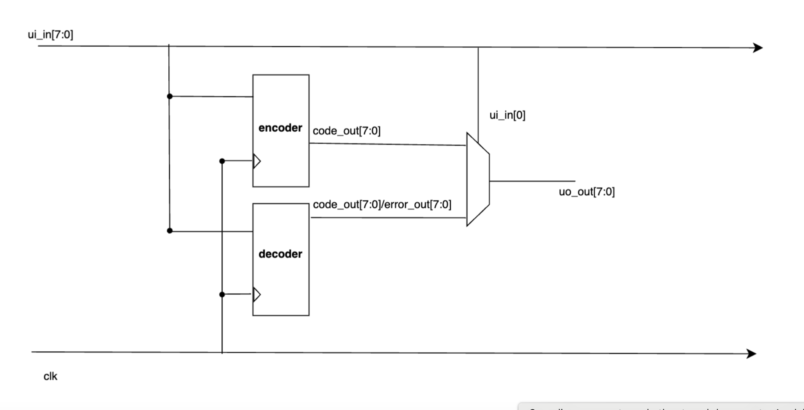
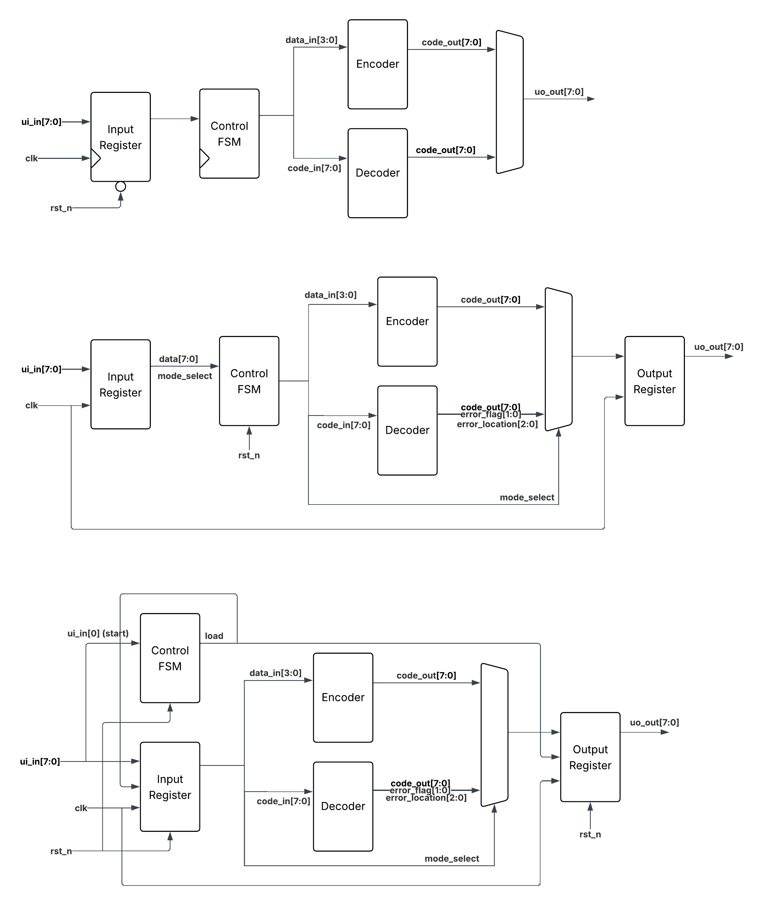

# Design Specification and Function Description
#### Hamming Code Encoder/Decoder for Error Detection and Correction

*** to be completed ***

## Description
The project aims to design a digital circuit block that implements the Hamming code. It will consist of an encoder that encodes 4-bit data inputs into 8-bit code-words, and a decoder that will receive 8-bit codewords to detect and correct single-bit errors. It will also be able to detect 2-bit errors.

| Direction               | State | Mode | Pin          | Width | Description                                           |
|-------------------------|:-----:|:----:|:------------:|:-----:|:-----------------------------------------------------|
| **Input** ui_in[7:0]    | IDLE  |  –   | ui_in[0]     | 1     | start                                                 |
|                         | IN1   |  –   | ui_in[0]     | 1     | mode_select: 0 = encode, 1 = decode                  |
|                         | IN2   |  0   | ui_in[3:0]   | 4     | data_in: 4-bit dataword                               |
|                         |       |  1   | ui_in[7:0]   | 8     | code_in: 8-bit codeword                               |
| **Output** uo_out[7:0]  | OUT1  |  0   | uo_out[7:0]  | 8     | code_out: 8-bit codeword                              |
|                         |       |  1   | uo_out[7:0]  | 8     | code_out: corrected codeword                          |
|                         | OUT2  |  0   | uo_out[7:0]  | 8     | code_out                                              |
|                         |       |  1   | uo_out[1:0]  | 2     | error_flags: 00 = error free, 01 = 1-bit error, 10 = 2-bit error |
|                         |       |      | uo_out[4:2]  | 3     | error_location (of 1-bit error)                       |

| Error_flag | Description                                                |
|------------|------------------------------------------------------------|
| `00`       | No error; position – don’t care                             |
| `01`       | 1 error – `error_position` will be 0 ≤ x < 8                |
| `10`       | 2-bit error detected; error position – don’t care           |
| `11`       | N/A – will not happen                                       |

## Block Diagram

`** further clarification/modification needed to make/choose a standard block diagram`

## Timing Diagram

## Test Plan
#### Test 1 - Check encoding logic
  - define a lookup table containing data inputs with the corresponding outputs expected
  - loop through known 4-bit inputs, verify output matches expected 8-bit
#### Test 2 - Decode known 8-bit inputs
  - Verify output matches expected 4-bit
  - Define lookup table containing inputs with corresponding outputs
#### Test 3 - Introduce single-bit errors in 8-bit codeword
  - Verify error has been detected
  - Verify error bit location is correct
  - Verify that the final result has been corrected
#### Test 4 - double error detection
  - Introduce double-bit errors in 8-bit, decode, and verify errors have been detected

## Logs
- ... (previous activities to be added)

- June 27: transferred initial documentation/resources from google doc

### TODO: next steps 
    1. Complete info.md documentation
        - check repo & google doc history and log activities/timelines
        - organize resources
        - add description in details
        - fix/finish block diagram & timing diagram

    2. GDS github action
        - (to be done in a new branch)
        - isolate functional encoder code
        - fix gds errors

    3. More coding
        - finish decoder
        - debugging

    4. Test cases
        - write a complete set of test cases according to test plan